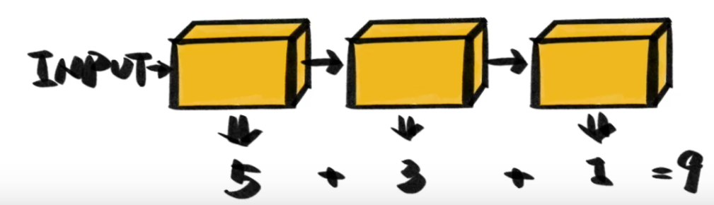

# [GBDT](https://www.cnblogs.com/pinard/p/6140514.html)

GBDT 是决策树的集成模型，它通过寻找最佳分割点来学习决策树。 XGBoost 和LightGBM是属于梯度提升决策树 (GBDT) 系列的package

## 0. 原理

### 0.1 概述

GBDT也是集成学习Boosting家族的成员，但是却和传统的Adaboost有很大的不同。GBDT也是迭代，使用了前向分布算法，但是弱学习器限定了只能使用CART回归树模型，同时迭代思路和Adaboost也有所不同。

在GBDT的迭代中，假设我们前一轮迭代得到的强学习器是$f_{t−1}(x)$, 损失函数是$L(y,f_{t−1}(x))$, 我们本轮迭代的目标是找到一个CART回归树模型的弱学习器$h_t(x)$，让本轮的损失函数$L(y,f_t(x))=L(y,f_{t−1}(x)+h_t(x))$最小。也就是说，本轮迭代找到决策树，要让样本的损失尽量变得更小。

> BDT的思想可以用一个通俗的例子解释，假如有个人30岁，我们首先用20岁去拟合，发现损失有10岁，这时我们用6岁去拟合剩下的损失，发现差距还有4岁，第三轮我们用3岁拟合剩下的差距，差距就只有一岁了。如果我们的迭代轮数还没有完，可以继续迭代下面，每一轮迭代，拟合的岁数误差都会减小

说人话就是：GBDT中的树是回归树，下一棵树预测的是{(之前所有树预测的结果之和) - (真实值)}

### 0.2 负梯度拟合

损失函数的拟合方法：用损失函数的负梯度来拟合本轮损失的近似值，进而拟合一个CART回归树。

第t轮的第i个样本的损失函数的负梯度表示为
$$
r_{ti}=−[\frac{∂L(yi,f(xi))}{∂f(xi)}]_{f(x)=f_{t−1}(x)}
$$
利用$(x_i,r_{ti})$, i=1,2,..m, 我们可以拟合一颗CART回归树，得到第t颗回归树，其对应的叶节点区域$R_{tj}$, j=1,2,...,J, 其中J为叶子节点的个数。针对每一个叶子节点里的样本，我们求出使损失函数最小，也就是拟合叶子节点最好的的输出值$c_{tj}$如下：
$$
c_{tj}=argmin_c \sum_{x_i∈R_{tj}}L(y_i,f_{t−1}(x_i)+c)
$$
这样我们就得到了本轮的决策树拟合函数如下：
$$
h_t(x)=\sum_{j=1}^J c_{tj}I(x∈R_{tj})
$$
从而本轮最终得到的强学习器的表达式如下：
$$
f_t(x)=f_{t−1}(x)+\sum_{j=1}^J c_{tj}I(x∈R_{tj})
$$
通过损失函数的负梯度来拟合，我们找到了一种通用的拟合损失误差的办法，这样无轮是分类问题还是回归问题，我们通过其损失函数的负梯度的拟合，就可以用GBDT来解决我们的分类回归问题。区别仅仅在于损失函数不同导致的负梯度不同而已

## 1. RF和GBDT的区别

**相同点：**

- 都是由多棵树组成，最终的结果都是由多棵树一起决定。

**不同点：**

- **集成学习**：$RF$属于$Bagging$思想，而$GBDT$是$Boosting$思想
- **偏差-方差权衡**：$RF$不断的降低模型的方差，而$GBDT$不断的降低模型的偏差
- **并行性**：$RF$的树可以并行生成，而$GBDT$只能顺序生成(需要等上一棵树完全生成)
- **最终结果**：$RF$最终是多棵树进行多数表决（回归问题是取平均），而$GBDT$是加权融合
- **数据敏感性**：$RF$对异常值不敏感，而$GBDT$对异常值比较敏感
- **泛化能力**：$RF$不易过拟合，而$GBDT$容易过拟合 ([梯度增强器实际上**更容易过拟合**](https://www.quora.com/Why-is-the-boosting-algorithm-robust-to-overfitting) adaboosting 不容易过拟合)